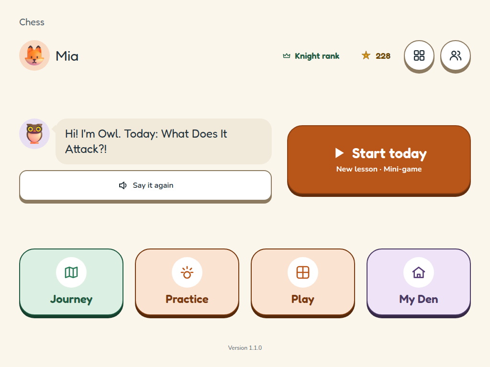
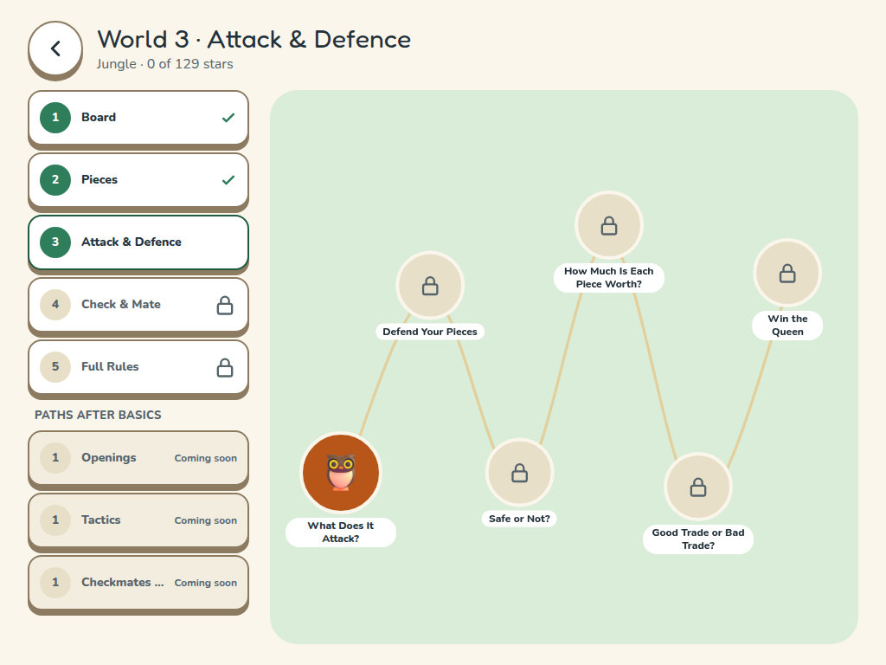
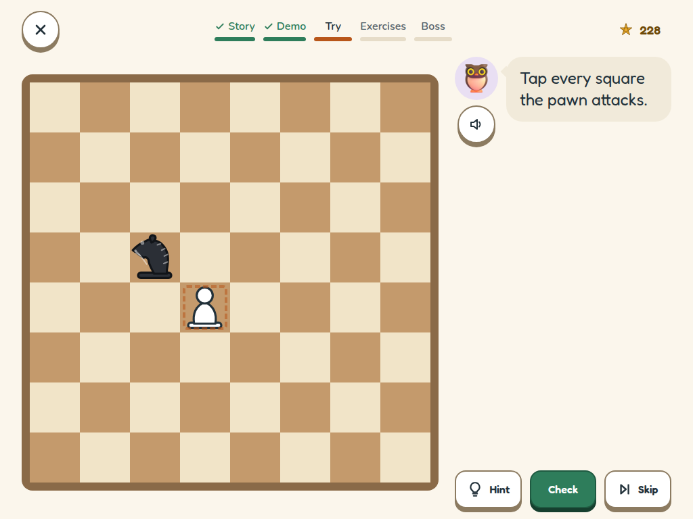
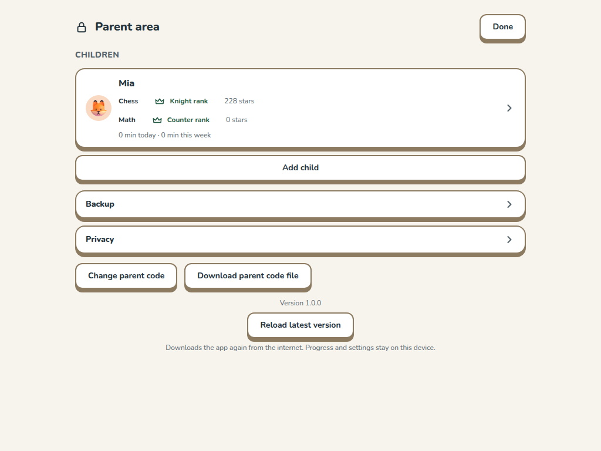

# Kids Learning

An offline, ad-free learning app for children aged 8–9: one app, several subjects, each taught one
small idea at a time through animal-themed lessons, mini-games and spoken instructions.

**Live app:** https://enricoag1982.github.io/kidsLearning/

| Subject | Status |
|---|---|
| Chess | Basics (5 worlds, 23 lessons), computer opponent (5 levels), play vs a friend; 3 paths planned |
| Math | Demo (1 world, 3 lessons); full course planned (v1.2) |
| Coding, Logic | Planned (v1.1, v1.3) — [`docs/new-subjects.md`](docs/new-subjects.md) |

Forked from [learningChess](https://github.com/enricoag1982/learningChess) (Chess for Kids v4.1.0);
multi-subject plan: [`docs/multi-subject.md`](docs/multi-subject.md).

## Who it's for

An 8-year-old just starting out, playing solo or side by side with a parent. Every lesson is
spoken aloud (subtitles too), touch targets are big, and there's no reading required to get
started.

## How a lesson works

Each lesson walks through five steps (chess shown):

1. **Story** — a piece character (the Rook, the Bishop, …), guided by Owl, introduces the idea.
2. **Demo** — Owl shows the move on the board.
3. **Try** — a couple of guided tries with help on hand.
4. **Exercises** — a rising-difficulty set of tasks (tap squares, capture, choose, set up a
   position, and more), each worth up to 3 stars. Stuck twice on a hard one? An easier version is
   offered.
5. **Boss** — a mini-game that puts the new skill to use.

Progress, stars, and rewards (your pieces, badges, a streak) are saved automatically and never
leave the device.

## Chess: the Basics (Worlds 1–5)

| World | Habitat | Teaches |
|---|---|---|
| 1 · Board | Meadow | Squares, rows/columns/diagonals, setting up the board |
| 2 · Pieces | Savannah | How each piece moves and captures, promotion |
| 3 · Attack & Defence | Jungle | What a piece attacks, safe vs. hanging, piece values, trades |
| 4 · Check & Mate | Mountains | Check, escaping check, checkmate, mate in 1, stalemate |
| 5 · Full Rules | River | Castling, en passant, draws — then a full game vs. the computer |

After the Basics, three paths are planned: **Openings**, **Tactics**, and **Checkmates & Endgames**.

## Screenshots

| Home | Journey map |
|---|---|
|  |  |

| A lesson | Parent area |
|---|---|
|  |  |

## Run it yourself

```sh
pnpm install
pnpm dev              # http://localhost:5173
pnpm test             # unit + content tests
pnpm test:slow        # slow unit tests (bot self-play / strength / timing, winnability, deep perft)
pnpm build             # production build
pnpm test:e2e         # Playwright, against the production build
pnpm dev:math          # math demo app (proves the platform is reusable; not deployed)
```

## Documentation

| Doc | Content |
|---|---|
| [`docs/multi-subject.md`](docs/multi-subject.md) | Multi-subject app plan (v1.0) |
| [`docs/new-subjects.md`](docs/new-subjects.md) | Subject ideas, ranking |
| [`docs/subjects/chess/teaching-process.md`](docs/subjects/chess/teaching-process.md) | Chess pedagogy: principles, learning loop, phases, mini-games |
| [`docs/subjects/chess/curriculum.md`](docs/subjects/chess/curriculum.md) | Chess lesson list and mini-game catalogue |
| [`docs/app-structure.md`](docs/app-structure.md) | Modes, profiles, navigation, progression |
| [`docs/domain-model.md`](docs/domain-model.md) | Entities, exercise types, rules |
| [`docs/architecture.md`](docs/architecture.md) | Stack, layers, repo layout, decisions |
| [`docs/subjects/chess/computer-opponent.md`](docs/subjects/chess/computer-opponent.md) | Bot levels (Mouse → Bear) |
| [`docs/rewards.md`](docs/rewards.md) | Stars, badges, streak |
| [`docs/non-functional.md`](docs/non-functional.md) | Offline, accessibility, privacy, performance |
| [`docs/screens.md`](docs/screens.md) | UI rules and screen list |
| [`docs/roadmap.md`](docs/roadmap.md) | Milestones, playtests, decisions |
| [`docs/privacy-policy.md`](docs/privacy-policy.md) | Privacy policy (also in-app, parent area → Privacy) |
| [`docs/release.md`](docs/release.md) | Release checklist, tagging, rollback |
| [`CONTRIBUTING.md`](CONTRIBUTING.md) | Workflow, branches, quality gate |

## Licence notes

- Chess rules engine: [chess.js](https://github.com/jhlywa/chess.js) (BSD-2-Clause).
- Fonts: Fredoka and Nunito, via [Fontsource](https://fontsource.org/) (SIL Open Font License).
- No third-party analytics, ads, or tracking of any kind — see
  [`docs/privacy-policy.md`](docs/privacy-policy.md).

## Credits

- Animal art: [Fluent Emoji 3D](https://github.com/microsoft/fluentui-emoji) by Microsoft, via
  [@lobehub/fluent-emoji-3d](https://www.npmjs.com/package/@lobehub/fluent-emoji-3d) (MIT — full
  notice: [`apps/chess-kids/public/licenses/fluent-emoji.txt`](apps/chess-kids/public/licenses/fluent-emoji.txt)).
- Narration voice: generated offline with [Kokoro](https://huggingface.co/hexgrad/Kokoro-82M)
  (Apache License 2.0) — see [`docs/voice.md`](docs/voice.md).
